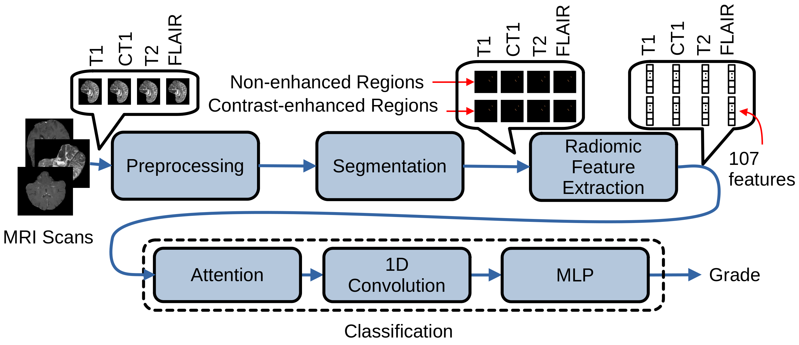

# Attention-Based Radiomics for-predicting gliomas histological grade

This repository presents an innovative deep learning framework for predicting the histological grade of gliomas. The proposed pipeline begins with the pre-processing of multimodal MRI sequences (T1, contrast-enhanced T1 (CT1), T2, and FLAIR), followed by fully automatic tumor segmentation using HD-GLIO-AUTO. Based on the segmented tumor subregions, radiomics features are extracted and subsequently used as input to a neural network architecture that leverages an attention mechanism to effectively fuse multimodal information for glioma grading.

An overview of the pipeline is reported below:

# Pre-Processing and Radiomic Feature Extraction
MRI scans are pre-processed to ensure consistent orientation, spatial alignment, and removal of non-brain structures. Steps include:
1.	Reorientation to FSL RAS convention
2.	Brain extraction using HD-BET
3.	Multimodal co-registration, selecting the highest-resolution sequence as reference
4.	Brain masking to remove interpolation artifacts
   
After pre-processing, images are automatically segmented using HD-GLIO-AUTO (nnU-Net–based) on T1, contrast-enhanced T1, T2, and FLAIR sequences. 
Two tumor masks are generated:
- Contrast-enhancing regions (active tumor core)
- Non-enhancing regions (infiltrative tumor and edema)

Radiomics converts imaging information into high-dimensional quantitative descriptors characterizing morphology, intensity statistics, and texture. Features are grouped into:
1. Shape-based features – 3D geometry of the lesion
2. First-order statistics – distribution of voxel intensities
3. Texture-based features – spatial arrangements and intensity dependencies

Feature extraction is performed using PyRadiomics with the following settings:
- Gray-level discretization: bin width = 5
- Intensity normalization: scale factor = 100
- Voxel array shift: 300 (to avoid negative values)
- Isotropic resampling: voxel spacing = [1,1,1] mm

Each image is represented by a radiomic feature vector of 107 dimensions. With four scans per patient and two segmentations per scan, each patient has 8 feature vectors, forming a matrix $P \in \mathbb{R}^{8 \times 107}$.

These vectors can be used as input for downstream predictive models (e.g., classification or outcome prediction).
