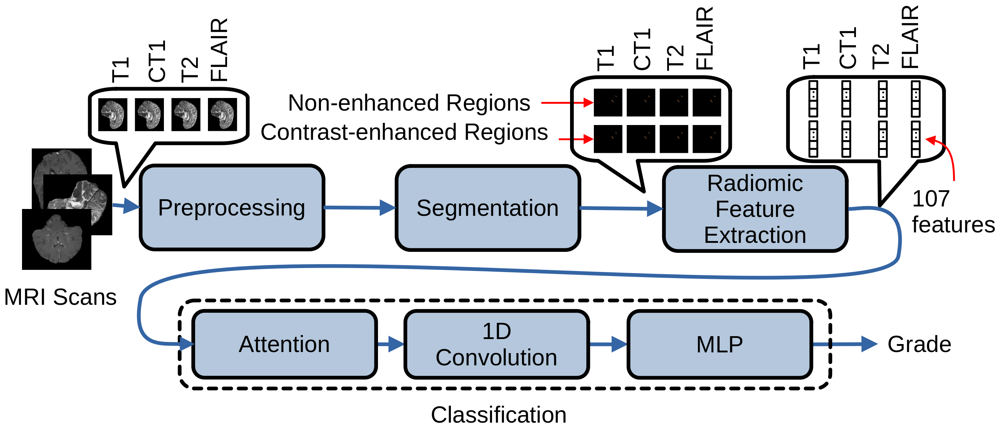

# Attention-Based Glioma Histological Grading 

This repository contains the implementation of an attention-based deep learning framework for automatic glioma histological grade classification using multimodal MRI radiomic features, in accordance with the World Health Organization (WHO) criteria.

## Overview
The proposed pipeline integrates deep learning and radiomics to provide an accurate and interpretable assessment of glioma histological grade. The method is designed to support clinical decision-making, prognosis estimation, and early risk stratification.

## Pipeline
1. MRI preprocessing (normalization, registration)
2. Automatic tumor segmentation using state-of-the-art deep learning models
3. Radiomic feature extraction (intensity, texture, shape)
4. Attention-based classification network
5. Model evaluation and external validation



## Datasets
- **UCSF-PDGM Dataset**  
  Publicly available dataset for glioma grading
  👉 https://www.cancerimagingarchive.net/collection/ucsf-pdgm/

- **External Clinical Cohort**  
  Independent dataset used for external validation (not publicly available)

## Radiomic Features
Radiomic features are extracted following standardized definitions and include:
- First-order statistics
- Texture features (GLCM, GLRLM, GLSZM)
- Shape and morphological descriptors

## Model
The classification framework employs:
- Attention mechanisms to weight informative radiomic features
- Convolutional layers to capture local patterns and interactions among radiomic features
- MLP for final classification

## Results
Experimental results on the UCSF-PDGM dataset and an independent clinical cohort demonstrate performance comparable to existing baselines, while offering enhanced interpretability through radiomic feature analysis.

## Clinical Impact
By combining deep learning with interpretable radiomic features, the proposed approach supports:
- Accurate glioma grading
- Prognosis estimation
- Early risk stratification and preventive clinical decision-making

## Requirements
- FSL 👉 https://fsl.fmrib.ox.ac.uk/fsl/docs/
- HD-BET 👉 https://github.com/MIC-DKFZ/HD-BET 
- HD-GLO-AUTO 👉 https://github.com/CCI-Bonn/HD-GLIO

Ensure all tools are correctly installed and available in your system `PATH`.


To install all the Python dependencies, run the following command:

```bash
pip install -r requirements.txt
```
## Usage

This pipeline performs MRI preprocessing, automatic tumor segmentation, and radiomic feature extraction from multimodal brain MRI data.

### Input Requirements
The input directory must contain the following NIfTI files corresponding to a single patient:

- `T1.nii.gz`
- `CT1.nii.gz` (contrast-enhanced T1)
- `T2.nii.gz`
- `FLAIR.nii.gz`

All images must be spatially aligned and stored in the same directory.

### Running the Pipeline for Preprocessing, Segmentation, and Feature Extraction
```bash
python run_pipeline.py \
  -i /path/to/input_directory \
  -o /path/to/output_directory \
  --device 0 \
  --verbose
````

- `-i` or `--input_dir`: Path to the input directory containing the input NIfTI files.
- `-o` or `--output_dir`: Path to the output directory where the results will be saved.
- `--device`: Index of the CUDA device to use (default: 0).
- `--verbose`: Print the commands before running them (default: False).

#### Model Training and Evaluation on UCSF-PDGM Dataset
```bash
python train_AttnFuseNet.py -c binary or multiclass 
```

- `-c` or `--classification`: Type of classification task to perform (either "binary" or "multiclass").

Note: The model is trained  and tested using the UCSF-PDGM radiomic features extracted and stored in /data/UCSF_features.csv.


### To evaluate the model on the  UCSF-PDGM test set
```bash
python test_UCSF_testset.py -c binary or multiclass 
```

- `-c` or `--classification`: Type of classification task to perform (either "binary" or "multiclass").

### To evaluate the model on the whole UCSF-PDGM dataset
```bash
python test_all_UCSF.py -c binary or multiclass 
```

- `-t` or `--task`: Type of classification task to perform (either "binary" or "multiclass").

## Citation

[](https://doi.org/10.1007/978-3-032-31927-2_2)

If you use this model in your research, please cite:

> Amato, D., Caruso Bavisotto, C., Calderaro, S., Lo Bosco, G., Palazzotto, F. M., Rizzo, R., Veiceschi, P., & Vella, F. (2026, August). Attention-Based Radiomics to Predict Histological Grade of Gliomas. In *International Conference on Pattern Recognition* (pp. 17–31). Cham: Springer Nature Switzerland.

<details>
<summary><b>BibTeX</b></summary>

```bibtex
@InProceedings{Amato2027RadiomicsGliomas,
  author    = {Amato, Domenico and
               Caruso Bavisotto, Celeste and
               Calderaro, Salvatore and
               Lo Bosco, Giosu{\'e} and
               Palazzotto, Francesca Maria and
               Rizzo, Riccardo and
               Veiceschi, Pierlorenzo and
               Vella, Filippo},
  editor    = {De Marsico, Maria and
               Ho, Tin Kam and
               Jurie, Frederic and
               Liu, Cheng-Lin and
               Lopresti, Daniel and
               Nystr{\"o}m, Ingela and
               Ogier, Jean-Marc and
               Ross, Arun and
               Wang, Liang},
  title     = {Attention-Based Radiomics to Predict Histological Grade of Gliomas},
  booktitle = {Pattern Recognition},
  year      = {2027},
  publisher = {Springer Nature Switzerland},
  address   = {Cham},
  pages     = {17--31},
}
```

## Contact 
For questions, feedback, or collaboration opportunities, please contact:
📧 salvatore.calderaro01@unipa.it
